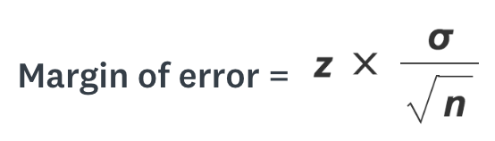

## Hypothesis testing: Getting from data to conclusion

**How do we get from a sample with a correlation to talking about testing a hypothesis for a population?**

1. The *68-95-99.7 Rule*

                + Allows us to estimate probability based on distance from the mean
                + Applies to normal distribution
                
2.  We need to tie sample to population
                
                + Population - The entire group we want to draw conclusions about
                + Sample - The subset of the population that we draw data from
                
3. Two rules to tie sample to probability distributions and population estimates:  

                + **The Central Limit Theorem** 
                + **The Law of Large Numbers**
                
4. Two statistics to tie sample to population estimates: *standard error* and *z-score* 

                + The standard error is a special case of the standard deviation
                + The z-score is a fairly simple problem involving subtracting two numbers and dividing by the standard error
                + Bonus: the z-score is one of our hypotheses test values for large sample sizes
                + Extra bonus: the cutoff point for the z-score in a hypothesis test is really easy to remember


$$\\[4in]$$

## The 68-95-99.7 Rule


[Source:https://towardsdatascience.com/understanding-the-68-95-99-7-rule-for-a-normal-distribution-b7b7cbf760c2](https://towardsdatascience.com/understanding-the-68-95-99-7-rule-for-a-normal-distribution-b7b7cbf760c2)

$$\\[4in]$$

## Population and Sample examples

+ Polling
                
                + Your campaign advisor told you that in a random sample of 100 likely voters, 56 intend to vote for you.
                + The sample is 100
                + The population is: __________
                
+ Clinical trials 

                + We're running a Phase III trial of a new drug for people *newly diagnosed* with acute lymphocytic leukemia
                + Our sample size is 100
                + Our population size is ~6,600 (diagnosed in the last year) OR our population size is much larger (all people newly diagnosed ever)
                + *The answer to the population size is not as important as the sample size*

$$\\[4in]$$


## Central Limit Theorem and Law of Large Numbers 

+ **The Central Limit Theorem**

                + **For a large number of trials, the means of the trials approach a normal distribution regardless of the underlying distribution of the data**
                + This means that for a sufficient number of trials, we can apply the normal distribution to the sample means.
                + This allows us to apply the 68-95-99.7 rule!
              

+ **Law of Large Numbers**

                + **Averages from independent, identically distributed samples converge to the population means that they are estimating.**
                + In its strongest form, the law states that this "almost surely" happens. 
                + This means that for a sufficiently large sample size, we can assume with a degree of certainty that our sample accurately represents the population!
                + [Stephen Moore](https://rpubs.com/stephenmoore56/301283) offers code to simulate the Law of Large Numbers
                
                
```{r, echo=FALSE}
set.seed(276)
options(scipen=999)

single_flip <- rbinom(1,1,.5)
two_flips <- rbinom(2,1,.5)
ten_flips <- rbinom(10,1,.5)
twentyfive_flips <- rbinom(25,1,.5)
fifty_flips <- rbinom(50,1,.5)
seventyfive_flips <- rbinom(75,1,.5)
hundred_flips <- rbinom(100,1,.5)
thous_flips <- rbinom(1000,1,.5)
twothou_flips <- rbinom(2000,1,.5)
tenthous_flips <- rbinom(10000,1,.5)
twfithou_flips <- rbinom(25000,1,.5)
threethou_flips <- rbinom(3000,1,.5)


a <- mean(single_flip)
g <- mean(two_flips)
h <- mean(ten_flips)
j <- mean(twentyfive_flips)
b <- mean(fifty_flips)
i <- mean(hundred_flips)
c <- mean(thous_flips)
e <- mean(twothou_flips)
d <- mean(tenthous_flips)
f <- mean(seventyfive_flips)
k <- mean(threethou_flips)

means <- c(a,g,h,j,b,i,c,e,d,f,k)

number_flipped <- c(1,2,10,25,50,100,1000,2000,10000,75,3000)

df <- data.frame(means,number_flipped)

plot(df$number_flipped,df$means, ylim = c(0,1))
abline(h = 0.5)

mean(twfithou_flips)

```

    
+ What's this tell us about sample size?

                + The CLT begins to apply at a sample size around 30
                + The sample size we need is determined by a number of things including the degree of certainty we are looking for
                
                + Want to do some polling? This is where margin of error comes from: 

