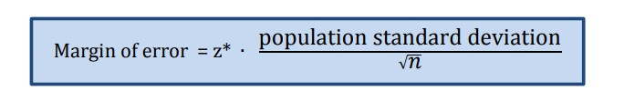

## Today: Frequency Distributions - Standard Errors and Z-Scores

## Minor announcement: Everyone did well on the midterm. I'll hand them back tomorrow so you can start on corrections if you want some extra cushion for your grade. The grade *distribution* for all the work so far is heavily skewed with a median grade in the A/A- range and the low grade not much below that. 

$$\\[5in]$$

## We're working with the normal distribution here - either in the underlying DGP or because of Central Limit Theorem

## Previous discussion and how it fits

+ 68-95-99.7 rule
+ Need to tie sample to population **Today**
+ Central Limit Theorem - ties sample to normal distribution
+ Law of Large Numbers - ties the sample to the population conceptually
+ Standard Error - ties sample measures to population
+ Z-score - translates Standard Error to probability terms

$$\\[5in]$$

## Tying samples to populations

  + Terms
  
     + statistics - sample
     + parameter - population
   
  + We want to use the *sample* mean/median/etc to *estimate* the *population* version of the same value
  + If you hear something like "We used the statistic to estime the parameter" it's the same thing!


## Standard Error

+ Quantifies the range around population value (parameter) for the sample value (the statistic)
+ Usually the **mean** but you can figure a standard error for other statistics like the median
+ Distance from the mean is a...

$$\\[5in]$$


## Standard Deviation


$$\\[5in]$$

+ **The Standard Error of the Mean:**

  + Standard deviation measures dispersion relative to the mean
  + Standard error measures dispersion between the sample mean and the population mean
  + Standard error of the mean is the standard deviation of the sample divided by the square root of the sample size:
  
<p style="color:red;text-align:center;font-size: 60px;">$\frac{s}{\sqrt{n}}$</p>  

$$\\[5in]$$

  + I told you earlier that Standard Error **is** a Standard Deviation: It is the standard deviation of the *sample means*.
    
    + If we do 1000 trials of random, indendepent, identically distributed variables (random IID variables) from any distribution
    + The means of each trial are the sample means
     + Central Limit Theorem tells us that if the distribution of the sample means will converge to a normal distribution 
     + If we made a vector of the means of the 10000 trials flipping a coin 20 times and plotted a histogram, it would look like this:
     
```{r, echo=FALSE}

v1 <- rbinom(10000,20, prob = .5)
hist(v1)

```
     
     
     + Law of Large Numbers tells us the sample statistic will approach the population parameter (sample mean will approach population mean)
     + That's the theoretical understanding. 
     + Practically, it is confused and confusing. If we do an experiment with 500 subjects, it's one trial with one sample mean. When we start doing hypothesis tests, this gets a different treatment using the same measurements - standard error and z-score.


$$\\[5in]$$


## Z-Score

+ Number of standard errors from the mean 
+ In terms of sample statistics and population parameters, it tells us the probability that that the actual population parameter is within a certain distance from our sample statistic.
+ It lets us apply the rules of probability in a normal distribution 

  + If we know the sample mean, $\bar{x}$, is 50
  + standard error, $\sigma$, is 1
  + We want to locate the population mean, $\mu$
  
 
    
  + applying 68-95-99.7 would lead us to believe that there is a 99.7% probability that the true population mean is between $\bar{x} \pm 3 * SE$ or 50 $\pm$ 3. A 99.7% probability that the true population mean is between 47 and 53. 
  + **Confidence Interval** This is your first example of a **Confidence Interval**. The 99.7% *Confidence Interval* of the sample mean with a sample mean of 50 and standard error of 1 is 47 to 53. 
  + **The Z-score gives us a bit more precision**
  + <p style="color:red;text-align:center;font-size: 60px;">$z = \frac{x - \mu}{sigma}$</p>  
  + *The Confidence Interval with the Z-Score is sample mean $\pm$ the Margin of Error which we get from (just for illustration at this point)*:
  
  


$$\\[5in]$$


+ Why not just follow the 68-95-99.7 rule and use 2?

  + 68-95-99.7 was just an approximation. Actual value is 95.45%
  
  
  
  + So the precise 5% level for Z-score is 1.96
  + The second answer is - 2 **is** actually the mental shortcut that in practical terms gets used in research when it comes to hypothesis testing
  + Journal articles in political science typically publish the outcomes of the test, called regression coefficients, with the standard error underneath:
  
```{r, echo=FALSE}

data1 <- cars
model <- lm(dist ~ speed, data = data1)
library(stargazer)
stargazer(model, type = "text")


```
  
More on Z-scores and Standard Errors

[https://www.statisticshowto.com/probability-and-statistics/z-score/](https://www.statisticshowto.com/probability-and-statistics/z-score/)

[https://www.statisticshowto.com/probability-and-statistics/statistics-definitions/what-is-the-standard-error-of-a-sample/](https://www.statisticshowto.com/probability-and-statistics/statistics-definitions/what-is-the-standard-error-of-a-sample/)

[https://www.investopedia.com/ask/answers/042415/what-difference-between-standard-error-means-and-standard-deviation.asp](https://www.investopedia.com/ask/answers/042415/what-difference-between-standard-error-means-and-standard-deviation.asp)

[https://www.investopedia.com/ask/answers/021115/what-difference-between-standard-deviation-and-z-score.asp](https://www.investopedia.com/ask/answers/021115/what-difference-between-standard-deviation-and-z-score.asp)


