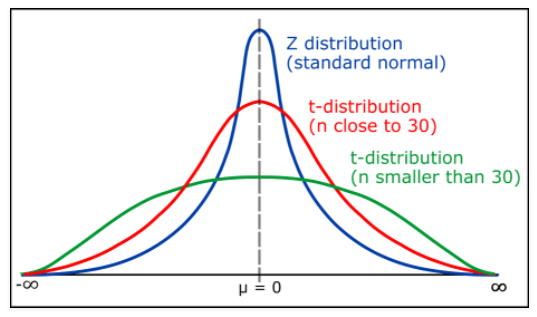

## Hypothesis tests

**$X^2$ (from Friday) and t-test (today) are simple enough to work out with a calculator, so a small data version of one or the other or both is likely to be on the final**

+ Friday

                + $X^2$ (Chi-squared) test
                + For categorical variables
                + aka as cross-tabs because of the format
                + worked through a $X^2$ test problem together 
                + This is on Problem Set 5 and final 
                
                
+ Today

                + Concepts of Z-score, Student's t-test, and ANOVA
                + Where each one is appropriate
                +  Brief discussion of the formulas for all three
                + We will work through a paired sample t-test together as our second example of hypothesis testing
                + Paired t-test is on Problem Set 5 and final 
                

 $$\\[5in]$$
 
 ## Hypothesis test uses
 
+ $X^2$ (Chi squared): Categorical variables with counts
+ Student's t-test: compares the means of two groups
+ z-score: continuous, normally distributed variables
+ ANOVA (Analysis of Variance)
+ Lots of others!

 $$\\[5in]$$

 ## Hypothesis test uses
 
+ $X^2$ (Chi squared): Categorical variables with counts

                + $X^2$ test of goodness of fit - tells whether the sample data is representative of the population
                + $X^2$ test of indendependence (we dit this) - tells us if two categorical variables are related or not
                
 $$\\[5in]$$
                

+ Student's t-test: compares the means of two groups 

Such as the sugar content of barley malt for use in brewing beet...

[https://www.youtube.com/watch?v=U9Wr7VEPGXA](https://www.youtube.com/watch?v=U9Wr7VEPGXA)

 $$\\[5in]$$
 
+ Student's t-test: compares the means of two groups 
               
                + pairwise comparison
                + one sample: comparing one group against a standard value
                + two-sample or independent t-test: compares two groups from different populations 
                + paired t-test: compares a single group as in before and after comparison
                + Two tailed test: tells if they are different, either greater or less
                + One tailed test: tells if one group is specifically greater or less, bot not either
                + *degrees of freedom* is *n - 1*
                + When t-test degrees of freedom $>$ 30, it converges on the z-score
                
       
 $$\\[5in]$$
 
                
 $$\\[5in]$$
                
+ z-score: continuous, normally distributed variables
                        
                + Continuous variables 
                + normal distribution
                + known population standard deviation 
                + "known" ~ accepted estimate
                + Central Limit Theorem can get us to normal
                + Use if: if the population standard deviation is known and sample size > 30
                
 $$\\[5in]$$
                
+ ANOVA (Analysis of Variance)

                + tests difference of means between 3 or more indendepnt groups
                + This is often used to test removing variables one at a time from a multi-variable model
                + Uses the *F-test*
                + The same F-test in regression results - model fit
                
 $$\\[5in]$$                

 ## Deeper look at t-tests
 
+ 
 
+ Paired sample t-test
+ $t = \frac{x_{diff}}{s_{diff}/\sqrt{n}}$
 
 
                + $x_{diff}$: sample mean of the differences
                + $s_{diff}$: sample standard deviation of the differences
                + n: sample size (in pairs)

+I'll show a short example and then we'll work through a short one

Second Example Data:

Group 1: (12.2, 14.6, 13.4, 11.2, 12.7, 10.4, 15.8, 13.9, 9.5, 14.2)
Group 2: (13.5, 15.2, 13.6, 12.8, 13.7, 11.3, 16.5, 13.4, 8.7, 14.6)

More on reading t-tables plus 1- and 2- tailed tables here:

[https://www.statisticshowto.com/tables/t-distribution-table/](https://www.statisticshowto.com/tables/t-distribution-table/)
