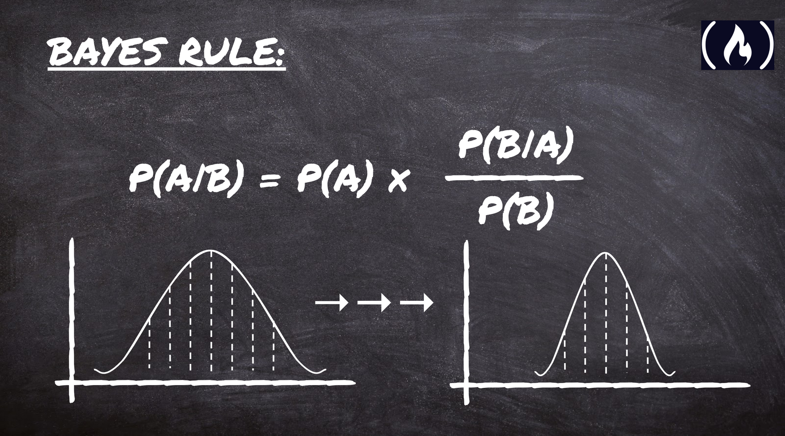

## Plan for Today - Thursday

+ Probability = 1 week
+ Frequency Distributions = 1 week
+ Lecture tomorrow: Finish probability / start frequency distributions
+ Lab today - Probability practice - using math operations
+ Lab tomorrow - Probability using R frequency distribution functions
+ Expectations for today: Understand how probability applies to the study of political (or any) science. Understand basic assumptions/rules about probability. Be able to do relatively simple probability computations by hand and in R. 
+ Midterm will included everything through Thursday as regular questions. There may be bonus questions from Friday and Monday material. 

$$\\[5in]$$

## Why do we need this?

### $y = \alpha + \beta X_i + \epsilon$

+ Probability and Frequency Distributions set the foundation for hypothesis testing
+ Our ultimate goal is to say a correlation is meaningful

+ We define meaningful as being *significant* to a certain *probability*
+ We need *probability theory* to get there
+ Why? There is an *element of randomness* in our data
+ Probability *models* randomness or chance
+ Significance is essentially the probability that our answer is due to randomness and not truly meaningful

$$\\[4in]$$

### What is probability?

**Mathematical probability: the ratio of the cases of interest to the whole number of cases possible.**

P(A) = $\frac{possible_A}{all \; possible \; outcomes}$

This is often phrased as ratio of "favorable outcomes" to possible outcomes, where favorable means outcomes where A occurs.

Example: Coin flip

The ratio of heads in a coin flip (1) to the whole number of cases possible (heads (1) + tails (1) = 2).

$\frac{1}{2}$

leads us to

**Probability in statistical inference: Proportional times an outcome occurs if the experiment (or observation/data collection) is repeated a large number of times. ** (This should go on your exam notes!)

This is the **frequentist** interpretation. There is an important alternative definition you should be aware of, but that you are not responsible for in this class.

$$\\[4in]$$

####Bayesian interpretation

**Bayesian probability suggests that in statistical inference, probability is a method of updating our beliefs based on new evidence. This is based on Bayes Rule, which has been called "the most important rule in data science."**

P(A|B) - This is read: The probability of A given B. 
P(A) is our *prior* probability of A given no information about B. 

In other words, if we know that B is true (given B) what is the probability that A happens. 

[https://www.freecodecamp.org/news/bayes-rule-explained/](https://www.freecodecamp.org/news/bayes-rule-explained/)

Simplified explanation involving error rates in cancer tests: 
[https://betterexplained.com/articles/an-intuitive-and-short-explanation-of-bayes-theorem/](https://betterexplained.com/articles/an-intuitive-and-short-explanation-of-bayes-theorem/)

Good explanation using set notation:
[https://www.investopedia.com/terms/p/prior_probability.asp](https://www.investopedia.com/terms/p/prior_probability.asp)

$$\\[4in]$$
### Some more set and probability terms

+ Sample space:  S - the set of possible outcomes
+ Event: s - a subset of the sample space of any size
+ s $\in$ S - s is an element of S
+ Empty set: $\emptyset$ - A subset of the sample space with no elements
+ The complement of s: $s^c$ - is all the elements of the sample space that is not s. 

### Examples:

+ S = {5,6,7,8,9,10}
+ s = {7,8}
+ $s^c$ = {5,6,9,10}

Example 2:

+ S = {5,6,7,8,9,10}
+ s = $\emptyset$ 
+ $s^c$ = {5,6,7,8,9,10}

Try this:

+ S = {5,6,7,8,9,10}
+ s = {6,7,8,9,10}
+ $s^c$ = 

$$\\[4in]$$

### More notation and terms

+ Union $\cup$ - A $\cup$ B is all outcomes that belong to either A or B or both. 
+ Intersection $\cap$ - A $\cap$ B is all outcomes that belong to both A and B. 
+ If A $\cap$ B  = $\emptyset$ the two sets are *disjoint*.

Example 1:

+ A = {1,2,3,4,5,6}
+ B = {5,6,7,8,9,10}
+ A $\cup$ B = {1,2,3,4,5,6,7,8,9,10}
+ A $\cap% B = [5,6]

Example 2:

+ A = {1,2,3,4,5,6,7,8,9}
+ B = {10}
+ A $\cup$ B = {1,2,3,4,5,6,7,8,9,10}
+ A $\cap$ B = ______

Example 3:

+ A = {1,2,3,4,5,6}
+ B = {7,8,9}
+ C = {10}
+ D = B $\cup$ C 
+ A $\cup$ D = 

$$\\[4in]$$
### Probability assumptions and rules

+ Probability is always between zero and one
+ Each possible outcome has a probability between zero and one
+ The probability that something occurs is 1
+ The probability that nothing occurs is 0
+ The probability of something is 1 minus the probability of the opposite
+ For two mutually exclusive sets, the probability of the union of the sets is the sum of their probabilities
$$\\[4in]$$
### Probabilities of opposites

+ S = {1,2,3,4,5,6,7,8,9,10}
+ A = {1,2,3,4,5}
+ B = {6,7,8,9,10}

A & B are opposites and complements. 

+ P(A) = 5 / 10 
+ P(B) = 1 - (5 / 10) = 5 / 10

### Example 2

+ S = {Heads, Tails}
+ P(Heads) = 1 / 2
+ P(Tails) = 1 - P(Heads) = 1 / 2

$$\\[4in]$$
Example of mutually exclusive sets: 

+ S = {1,2,3,4,5,6,7,8,9,10}
+ A = {1,2,3,4,5}
+ B = {6,7,8,9,10}

+ P (A) = 5 / 10
+ P(B) = 5 / 10
+ P(A $\cup$ B) = 

What if:

+ S = {1,2,3,4,5,6,7,8,9,10}
+ A = {1,2,3,4,5,6}
+ B = {5,6,7,8,9,10}

+ P (A) = 6 / 10
+ P(B) = 6 / 10
+ P(A $\cup$ B) = 

+ B $\cap$ A = {5,6}
+ P(B $\cap$ A) = 2 / 10

$$\\[4in]$$
